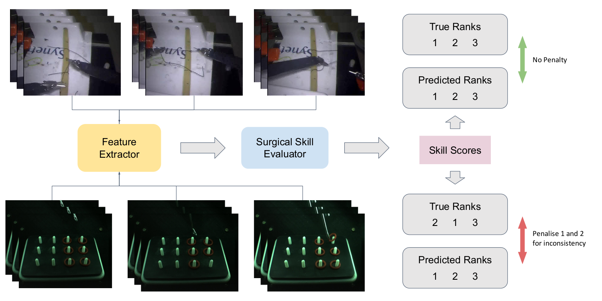

# NeuroEval

Representation learning using rank loss for robust neurosurgical skills evaluation.

     

## Installation

To install this repository and its dependent packages, run the following.

~~~
git clone https://github.com/myselfbritty/NeuroEval.git
cd NeuroEval
conda create --name NeuroEval # (optional, for making a conda environment)
conda install pytorch==1.6.0 torchvision==0.7.0 cudatoolkit=10.2 -c pytorch
pip install -r requirements.txt
~~~

## Dataset Setup

For JIGSAWS dataset with the extracted visual features, please refer to [TUSSA](https://github.com/Finspire13/Towards-Unified-Surgical-Skill-Assessment) and their provided files [here](https://drive.google.com/drive/folders/1fTDE764HVOAxUlaxWWc9fe66qSGoPxDi).

For NETS data, visit [Project page](https://nets-iitd.github.io/nets-v1).

The current paths assume these datasets to be in `./datasets/JIGSAWS` and `./datasets/NETS` respectively. You may follow the same directory structure or change the paths in the configs.

## Instructions to run

To train and test a model, make necessary changes in a config file and run the following command.
~~~
python3 main.py --config <config path> --log_dir <path to save logs>
~~~

For example, to run the default setting 4-fold validation on JIGSAWS, run the following.
~~~
python3 main.py --config configs/JIGSAWS_rank2/Knot_Tying/JIGSAWS_TVPE_4FOLD_Knot_Tying_0.json --log_dir logs/JIGSAWS_rank2
~~~

Similarly, to run the default setting train-test split on NETS, run the following.
~~~
python3 main.py --config configs/NETS_rank2/NETS_train_test.json --log_dir logs/NETS_rank2
~~~

## Acknowlegements

This repository benefits greatly from [`TUSSA`](https://github.com/Finspire13/Towards-Unified-Surgical-Skill-Assessment) and we thank its authors for this awsome work. 

## Cite this work

~~~bibtex
@inproceedings{baby2022representation,
    title={Representation Learning Using Rank Loss for Robust Neurosurgical Skills Evaluation},
    author={Baby, Britty and Chasmai, Mustafa and Banerjee, Tamajit and Suri, Ashish and Banerjee, Subhashis, and Arora, Chetan},
    booktitle={2022 29th IEEE International conference on image processing (ICIP)},
    year={2022},
    organization={IEEE}
}	
~~~